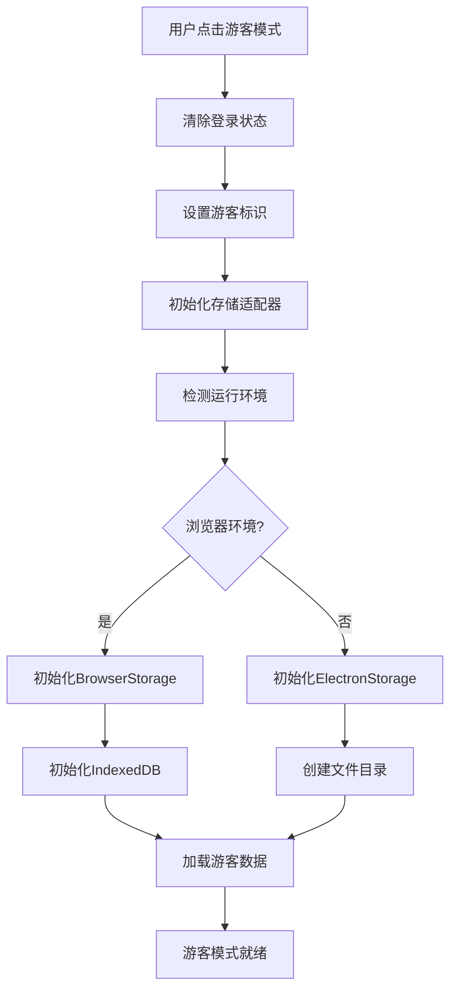
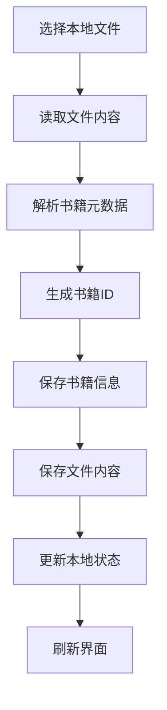
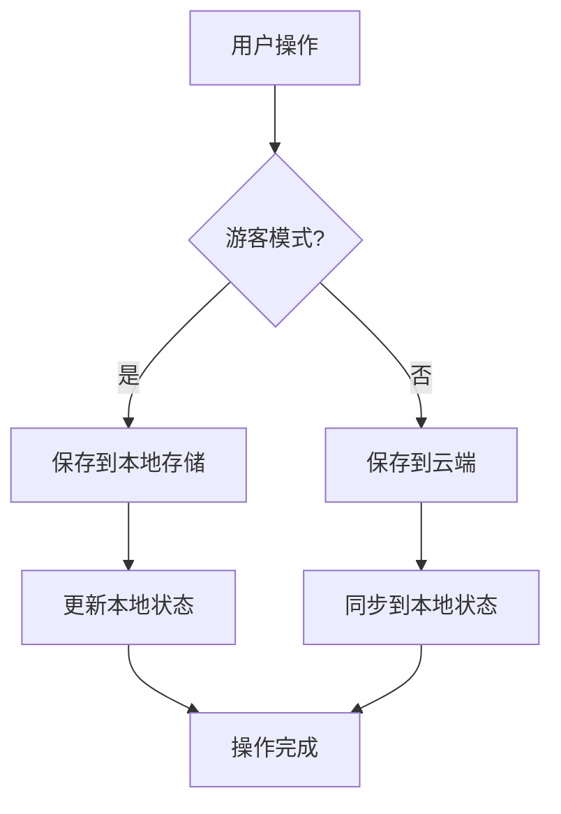
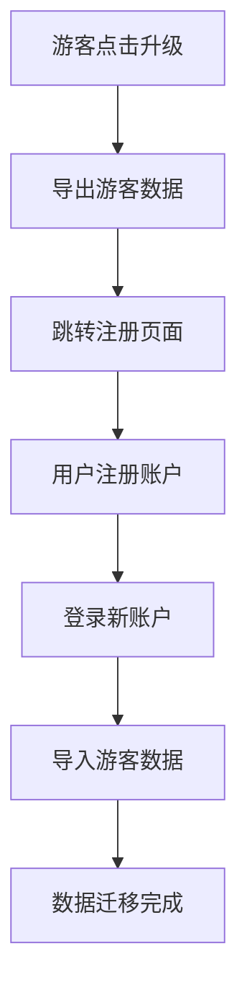

# 游客模式技术实现总结

## 概述

游客模式是电子书库应用的一个重要功能，允许用户在不注册账户的情况下体验完整的阅读功能。所有数据存储在用户的本地设备上，支持浏览器和桌面应用（Electron）环境。

## 核心架构

### 1. 统一存储适配器 (StorageAdapter)

**文件位置**: `src/utils/storageAdapter.js`

**功能**:
- 自动检测运行环境（浏览器/Electron）
- 提供统一的数据存储接口
- 支持云端和本地存储的无缝切换
- 数据导出导入功能

**主要方法**:
```javascript
// 环境检测
detectEnvironment()

// 数据操作
getBooks(), saveBooks(), addBook(), updateBook(), deleteBook()
getBookContent(), saveBookContent()
getReadingProgress(), saveReadingProgress()
getSettings(), saveSettings()

// 云端同步（登录模式）
getBooksFromCloud(), uploadBookToCloud()
getSettingsFromCloud(), saveSettingsToCloud()

// 数据管理
exportAllData(), importAllData(), clearAllData()
```

### 2. 浏览器存储实现 (BrowserStorage)

**文件位置**: `src/utils/browserStorage.js`

**技术栈**:
- **localStorage**: 存储用户设置、书籍元数据
- **IndexedDB**: 存储书籍内容、阅读进度等大量数据

**数据库结构**:
```javascript
// IndexedDB 对象存储
- books: 书籍信息 (keyPath: 'id')
- bookContents: 书籍内容 (keyPath: 'bookId')  
- readingProgress: 阅读进度 (keyPath: 'bookId')
```

**特性**:
- 支持大文件存储
- 事务安全
- 存储配额检查
- 数据统计功能

### 3. Electron存储实现 (ElectronStorage)

**文件位置**: `src/utils/electronStorage.js`

**技术栈**:
- **文件系统**: 使用Node.js fs模块
- **JSON文件**: 存储结构化数据
- **二进制文件**: 存储书籍内容

**文件结构**:
```
用户数据目录/EbookLibrary/
├── books.json          # 书籍列表
├── progress.json       # 阅读进度
├── settings.json       # 用户设置
└── contents/           # 书籍内容目录
    ├── book1.dat
    ├── book2.dat
    └── ...
```

**特性**:
- 完全离线存储
- 支持数据备份恢复
- 大文件高效处理
- 跨平台兼容

## 状态管理

### 1. 认证状态管理 (AuthStore)

**文件位置**: `src/stores/auth.js`

**游客模式相关状态**:
```javascript
state: {
  isGuest: false,           // 是否为游客模式
  mode: 'login',            // 'login' | 'guest'
  storageAdapter: null      // 存储适配器实例
}
```

**核心方法**:
```javascript
// 进入游客模式
enterGuestMode()

// 获取存储适配器
getStorageAdapter()

// 数据导出导入
exportGuestData(), importGuestData()

// 账户升级准备
prepareAccountUpgrade(), completeAccountUpgrade()
```

### 2. 书籍状态管理 (BookStore)

**文件位置**: `src/stores/book.js`

**游客模式适配**:
- 自动检测用户模式
- 本地搜索和过滤
- 游客专用的书籍添加方法
- 本地文件内容管理

**关键方法**:
```javascript
// 游客模式专用
fetchGuestBooks(), fetchGuestCategories()
addLocalBook()

// 通用方法（自动适配模式）
uploadBook(), searchBooks(), deleteBook()
getBookContent(), saveProgress()
```

### 3. 设置状态管理 (SettingsStore)

**文件位置**: `src/stores/settings.js`

**游客模式特性**:
- 本地设置存储
- 设置导出导入
- 自动保存功能
- 设置验证

## 用户界面适配

### 1. 登录页面 (Login.vue)

**新增功能**:
- 游客模式入口按钮
- 模式切换提示
- 升级账户引导

**UI元素**:
```vue
<!-- 游客模式按钮 -->
<button @click="handleGuestMode" class="btn btn-secondary guest-btn">
  <i class="icon-user"></i>
  游客模式体验
</button>
```

### 2. 头部导航 (Header.vue)

**游客模式指示器**:
```vue
<!-- 游客模式状态显示 -->
<div v-if="authStore.isGuest" class="guest-indicator">
  <span class="guest-badge">游客模式</span>
  <button @click="showUpgradeDialog" class="btn btn-sm btn-primary">
    升级账户
  </button>
</div>
```

### 3. 书库页面 (Library.vue)

**适配内容**:
- 页面标题动态显示
- 封面图片处理（base64/本地路径）
- 操作按钮文本调整

### 4. 上传页面 (Upload.vue)

**游客模式处理**:
- 本地文件处理流程
- 文件内容读取和存储
- 进度提示文本调整

### 5. 阅读器组件

**ReaderHeader.vue**:
- 下载功能适配（本地内容导出）
- 动态获取存储适配器

## 数据流程

### 1. 游客模式启动流程



### 2. 书籍添加流程（游客模式）



### 3. 数据同步流程



## 技术特性

### 1. 环境兼容性

- **浏览器支持**: Chrome, Firefox, Safari, Edge
- **存储技术**: localStorage + IndexedDB
- **文件大小**: 支持大文件存储（受浏览器配额限制）

- **桌面应用**: Electron环境
- **存储技术**: 文件系统
- **文件大小**: 无限制（受磁盘空间限制）

### 2. 数据安全

- **本地存储**: 数据不离开用户设备
- **隐私保护**: 无需注册，无数据收集
- **数据控制**: 用户完全控制自己的数据

### 3. 性能优化

- **懒加载**: 按需加载书籍内容
- **缓存机制**: 智能缓存常用数据
- **异步处理**: 非阻塞的文件操作
- **内存管理**: 及时释放大文件内存

### 4. 用户体验

- **无缝切换**: 登录模式和游客模式无缝切换
- **数据迁移**: 支持游客数据导出和账户升级
- **离线优先**: 完全离线工作，无网络依赖
- **响应式设计**: 适配各种屏幕尺寸

## 升级路径

### 1. 账户升级流程



### 2. 数据导出格式

```javascript
{
  books: [...],              // 书籍列表
  readingProgress: [...],    // 阅读进度
  settings: {...},           // 用户设置
  exportedAt: "2024-01-01T00:00:00.000Z",
  version: "1.0"
}
```

## 错误处理

### 1. 存储错误

- **配额超限**: 提示用户清理数据
- **权限错误**: 引导用户检查浏览器设置
- **数据损坏**: 提供数据恢复选项

### 2. 文件处理错误

- **格式不支持**: 明确的错误提示
- **文件过大**: 大小限制提醒
- **读取失败**: 重试机制

### 3. 环境兼容性

- **浏览器不支持**: 降级到基础功能
- **Electron错误**: 文件系统权限检查

## 测试策略

### 1. 单元测试

- 存储适配器功能测试
- 数据序列化/反序列化测试
- 环境检测逻辑测试

### 2. 集成测试

- 完整的游客模式流程测试
- 数据导出导入测试
- 模式切换测试

### 3. 用户测试

- 不同浏览器兼容性测试
- 大文件处理性能测试
- 长期使用稳定性测试

## 未来扩展

### 1. 功能增强

- 数据加密存储
- 云端备份选项
- 多设备数据同步（P2P）
- 离线搜索优化

### 2. 技术升级

- WebAssembly文件处理
- Service Worker缓存
- Progressive Web App支持
- 更多文件格式支持

## 总结

游客模式的实现为用户提供了完整的离线阅读体验，同时保持了与登录模式的功能一致性。通过统一的存储适配器架构，实现了代码的高度复用和维护性。该实现不仅满足了用户的隐私需求，也为应用的推广和用户转化提供了良好的基础。